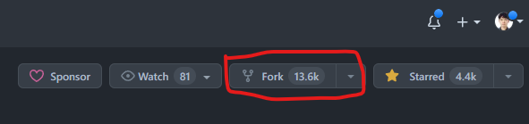
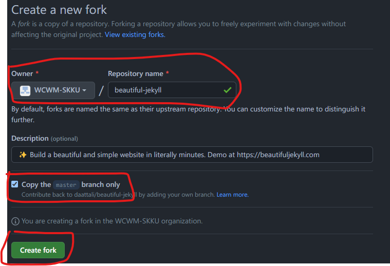

# 역사의 뒤안길로 사라진 균서닷컴...

필자는 약 상꺽 혹은 상말(?)부터 군대에서 WordPress를 이용해서, 나만의 작은 [테크 블로그](https://gyunseo.com)(~~호스팅 비용을 못 견디고 사라졌다ㅠㅠ~~)를 운영했었다. 군대에서 할 짓도 없었고, 엄청 열심히 포스팅을 올렸었다. 주 컨텐츠는 백준 풀이와 사지방에서도 편안하게 개발 할 수 있는 원격 개발 환경 구성이었다. 백준 풀이를 그때는 정말 참 열심히 했었던 거 같다. 백준을 그렇게 열심히 풀다보니, 어떻게 운이 좋아서 소마 2차 코테도 보게 됐고... (~~물론 면접도 못 가고 떨어졌다.~~) 각설하고 앞에서 언급했듯이 너무 비싼 호스팅 비용때문에 내 주머니 사정에 큰 부담이었고, WordPress라는 구닥다리 웹 개발 스택을 사용해서 안그래도 정이 별로 안갔었다. 그래서 돈도 아끼는 셈치고 전역과 동시에 균서닷컴은 역사의 뒤안길로 사라졌다. 그리고 그 이후로 약 7 개월 가량 테크 블로그 만들어야지... 만들어야지... 만 생각하다가, 12월이 1일 오늘이 돼서야 만들게 된다.

***

# 그래서 왜 GitHub Pages와 Jekyll?

1. ## 무료 도메인, 무료 호스팅
	일단 균서닷컴을 폐쇄한 가장 큰 이유는 호스팅 비용이 너무 많이 깨져서였다. 그런데 GitHub Pages는 호스팅 비용도 무료, 도메인 비용도 무료이다. 안하고 못 배긴다.

2. ## 도메인이 느낌있다.
	&lt;GitHub Handle&gt;.github.io 형태의 도메인이 그냥 개발자 테크 블로그스럽고, 멋있어 보였다. 실제로 백준 문제나 코딩하다가 구글링 했을 때, 도메인이 github.io이면 왠지 모르게 믿음직스러웠다.

3. ## 남들이 만들어 놓은 Jekyll Theme
	
	잘 만들어진 무료 테마가 많다는 것도 선택한 이유 중에 하나였다. <https://jekyllthemes.io/free> 사이트에 가면 무료 Jekyll Theme들이 즐비해 있다. 무료 테마 중에 가장 Star를 많이 받은, Beautiful Theme를 선택했다. 

4. ## Markdown 기반 포스팅
	Jekyll은 Markdown 문서를 기반으로 블로그 포스팅을 한다. 이 글도 Markdown으로 작성되는 중이다. Markdown은 실제로 개발자들 사이에서 상당히 많이 쓰이는 문서이다. (예를 들어, ~~GitHub라든지, GitHub라든지~~) 그리고 Obsidian과 같은 Markdown 작성 프로그램을 사용한다면, 손쉽고 편하게 문서를 뚝딱 만들 수도 있다. (지금도 Obsidian으로 작성 중이다.)

***

# 본격적으로 블로그 만들기

1. ## GitHub에서 Theme Fork하기
	[beautiful-jekyll](https://github.com/daattali/beautiful-jekyll)repository를 내 GitHub에 Fork하자. 나도 GitHub의 Fork가 뭔지 잘 몰라서, 시스템 프로그래밍할 때 배웠던, C언어의 fork() 함수를 떠올렸다. fork는 영어로 갈림길이라는 의미이다. 그 의미대로 C언어에서는 코드를 실행하다가 fork()가 실행된 시점부터, 자식 프로세스가 복제가 되어, 부모 프로세스로 부터 갈라져 나온다. GitHub의 fork도 비슷하다. 내가 딴 사람의 repository를 fork한 시점부터 나만의 repository를 갖게되는 것이다.
	   
	   
	
	위 사진과 같이 beautiful-jekyll repository에서 fork를 눌러서, 본인 repository에 fork한다.   
	
	    
	 
    위 사진과 같은 create a new fork 사이트로 넘어가면, 빨간색으로 그린 부분을 잘 확인하자.   
	  
	 1. Owner는 본인 Github Handle이 돼야 한다. (여기서는 필자가 미리 생성을 했어서, 내가 속한 딴 Organization이 대신 뜬 상태이다.) 
	 2. beautiful-jekyll의 master branch만 copy를 해야 한다.
	 3. 1, 2번이 잘 확인 됐으면, Creat fork를 눌러, 본인 repository로 fork를 진행한다.   
	 
       
	 
    fork가 잘 진행됐다면, 위 사진과 같이 본인 repository에 fork된 beautiful-jekyll이 생길 것이다. 그런데 다음과 같은 의미 들 수 있다. 
	 
	 
	
	