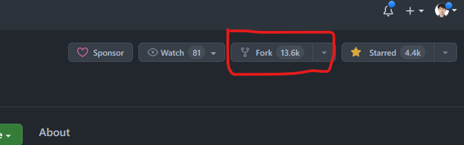
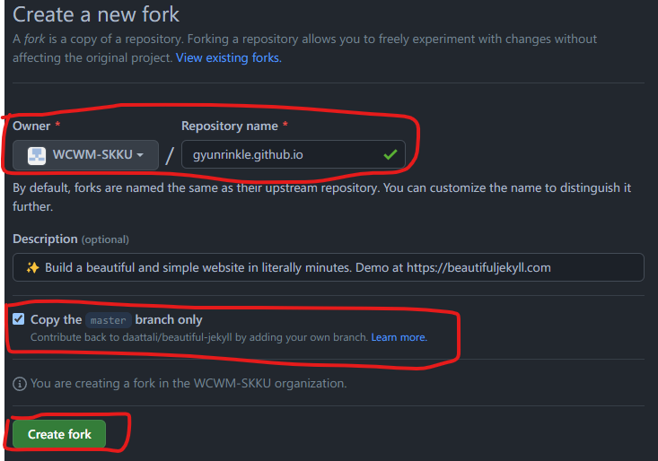
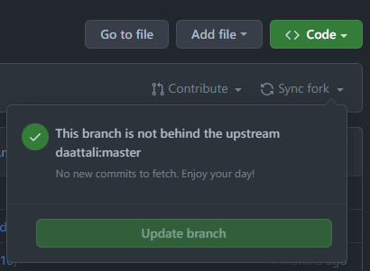

# 역사의 뒤안길로 사라진 균서닷컴...

필자는 약 상꺽 혹은 상말(?)부터 군대에서 WordPress를 이용해서, 나만의 작은 [테크 블로그](https://gyunseo.com)(~~호스팅 비용을 못 견디고 사라졌다ㅠㅠ~~)를 운영했었다. 군대에서 할 짓도 없었고, 엄청 열심히 포스팅을 올렸었다. 주 컨텐츠는 백준 풀이와 사지방에서도 편안하게 개발 할 수 있는 원격 개발 환경 구성이었다. 백준 풀이를 그때는 정말 참 열심히 했었던 거 같다. 백준을 그렇게 열심히 풀다보니, 어떻게 운이 좋아서 소마 2차 코테도 보게 됐고... (~~물론 면접도 못 가고 떨어졌다.~~) 각설하고 앞에서 언급했듯이 너무 비싼 호스팅 비용때문에 내 주머니 사정에 큰 부담이었고, WordPress라는 구닥다리 웹 개발 스택을 사용해서 안그래도 정이 별로 안갔었다. 그래서 돈도 아끼는 셈치고 전역과 동시에 균서닷컴은 역사의 뒤안길로 사라졌다. 그리고 그 이후로 약 7 개월 가량 테크 블로그 만들어야지... 만들어야지... 만 생각하다가, 12월이 1일 오늘이 돼서야 만들게 된다.

***

# 그래서 왜 GitHub Pages와 Jekyll?

## 무료 도메인, 무료 호스팅

일단 균서닷컴을 폐쇄한 가장 큰 이유는 호스팅 비용이 너무 많이 깨져서였다. 그런데 GitHub Pages는 호스팅 비용도 무료, 도메인 비용도 무료이다. 안하고 못 배긴다.

## 도메인이 느낌있다.

&lt;GitHub Handle&gt;.github.io 형태의 도메인이 그냥 개발자 테크 블로그스럽고, 멋있어 보였다. 실제로 백준 문제나 코딩하다가 구글링 했을 때, 도메인이 github.io이면 왠지 모르게 믿음직스러웠다.

## 남들이 만들어 놓은 Jekyll Theme


잘 만들어진 무료 테마가 많다는 것도 선택한 이유 중에 하나였다. <https://jekyllthemes.io/free> 사이트에 가면 무료 Jekyll Theme들이 즐비해 있다. 무료 테마 중에 가장 Star를 많이 받은, Beautiful Theme를 선택했다. 

## Markdown 기반 포스팅

Jekyll은 Markdown 문서를 기반으로 블로그 포스팅을 한다. 이 글도 Markdown으로 작성되는 중이다. Markdown은 실제로 개발자들 사이에서 상당히 많이 쓰이는 문서이다. (예를 들어, ~~GitHub라든지, GitHub라든지~~) 그리고 Obsidian과 같은 Markdown 작성 프로그램을 사용한다면, 손쉽고 편하게 문서를 뚝딱 만들 수도 있다. (지금도 Obsidian으로 작성 중이다.)

***

# 본격적으로 블로그 만들기

## GitHub에서 Theme Fork하기

[beautiful-jekyll](https://github.com/daattali/beautiful-jekyll) repository를 내 GitHub에 Fork하자. 나도 GitHub의 Fork가 뭔지 잘 몰라서, 시스템 프로그래밍할 때 배웠던, C언어의 fork() 함수를 떠올렸다. fork는 영어로 갈림길이라는 의미이다. 그 의미대로 C언어에서는 코드를 실행하다가 fork()가 실행된 시점부터, 자식 프로세스가 복제가 되어, 부모 프로세스로 부터 갈라져 나온다. GitHub의 fork도 비슷하다. 내가 딴 사람의 repository를 fork한 시점부터 나만의 repository를 갖게되는 것이다



위 사진과 같이 beautiful-jekyll repository에서 fork를 눌러서, 본인 repository에 fork한다.



위 사진과 같은 create a new fork 사이트로 넘어가면, 빨간색으로 그린 부분을 잘 확인하자.

1. Owner는 본인 Github Handle이 돼야 한다. (여기서는 필자가 미리 생성을 했어서, 내가 속한 딴 Organization이 대신 뜬 상태이다.) **그리고 repository 이름은 &lt;GitHub Handle&gt;.github.io이어야 한다.**
2. beautiful-jekyll의 master branch만 copy를 해야 한다.
3. 1, 2번이 잘 확인 됐으면, Creat fork를 눌러, 본인 repository로 fork를 진행한다.   

 

fork가 잘 진행됐다면, 위 사진과 같이 본인 repository에 fork된 beautiful-jekyll이 생길 것이다. 그런데 다음과 같은 의문이 들 수 있다. 

### 어 근데 fork랑 clone은 뭐가 다른 거지?

> fork는 다른 사람의 Github repository에서 내가 어떤 부분을 수정하거나 추가 기능을 넣고 싶을 때 해당 respository를 내 Github repository로 그대로 복제하는 기능이다. fork한 저장소는 원본(다른 사람의 github repository)와 연결되어 있다. 여기서 연결 되어 있다는 의미는 original repository에 어떤 변화가 생기면(새로운 commit) 이는 그대로 forked된 repository로 반영할 수 있다. 이 때 fetch나 rebase의 과정이 필요하다.
> 
> 
> [출처](https://velog.io/@imacoolgirlyo/Git-fork%EC%99%80-clone-%EC%9D%98-%EC%B0%A8%EC%9D%B4%EC%A0%90-5sjuhwfzgp)

 

위의 사진을 보니 이해가 되는 것 같다.

## fork한 repository를 local로 가져오기 (굳이 안해도 되나 하는 게 편함)

GitHub Desktop이나 Git CLI 등으로 fork한 repostitory를 local로 가져와서 관리하자. 
local로 가져와서 관리하면 다음과 같은 이점이 있다.
1. Obsidian과 같은 Markdown Editor 프로그램으로 포스팅을 쓸 수 있다.
2. Theme를 커스텀하고 싶을 때 VSCode와 같은 코드 에디터로 손쉽게 커스텀하여, 내 GitHub repository에 push를 할 수 있다.

그러면 본격적으로 Theme를 커스터마이징 하자.

## Theme 커스터마이징 하기

Theme 커스터마이징은 beautiful-jekyll GitHub README를 참고해서 진행했다.
[beatiful-jekyll GitHub README](https://github.com/daattali/beautiful-jekyll#build-your-website-in-3-steps) 링크를 타고 들어가서, 다음 항목을 읽어 본다.

>### 3. Customize your website settings
>
>Edit the `_config.yml` file to change any settings you want. To edit the file, click on it to view the file and then click on the pencil icon to edit it (watch the video tutorial above if you're confused). The settings in the file are self-explanatory and there are comments inside the file to help you understand what each setting does. Any line that begins with a hashtag (`#`) is a comment, and the other lines are actual settings.
>
>Note that in the video above only one setting in the `_config.yml` file is edited. **You should actually go through the rest of the settings as well. Don't be lazy, go through all the settings!**
>
>### 4. Congratulations! You have a website!
>
>After you save your changes to the `_config.yml` file (by clicking on _Commit changes_ as the video tutorial shows), your website should be ready in a minute or two at `https://<yourusername>.github.io`. Every time you make a change to any file, your website will get rebuilt and should be updated in about a minute or so. Your website will be initialized with several sample blog posts and a couple other pages.
>
>Note that this was the easy way to _create_ your website, but it does come at a cost: when Beautiful Jekyll gains new features in the future, _updating_ your website to include all the latest features is cumbersome. See the [FAQ](https://beautifuljekyll.com/faq/#updating) for help with upgrading in the future.

읽어보니, 일단은 `_cofig.yml`파일을 수정해야 한다. 그래서 필자는 다음과 같이 수정했다.
```yml
###########################################################
### Welcome to Beautiful Jekyll!
### This config file is meant for settings that affect your entire website. When you first
### set up your website you should go through all these settings and edit them, but after
### the initial set up you won't need to come back to this file often.
###########################################################

############################
# --- Required options --- #
############################

# Name of website
title: Gyunseo's Blog

# Your name to show in the footer
author: Gyunseo Lee

###############################################
# --- List of links in the navigation bar --- #
###############################################

navbar-links:
  About Me: "aboutme"
  Devlog:
    - WEB: "web"
    - GAME: "game"
  PS: 
    - 백준(BOJ): "boj"
    - LEETCODE: "leetcode"
  CS:
    - 운영체제(OS): "os"

################
# --- Logo --- #
################

# Image to show in the navigation bar - works best with a square image
# Remove this parameter if you don't want an image in the navbar
avatar: "/assets/img/avatar-icon.png"

# By default, the image is cut into a circle. You can disable this behaviour by setting 'round-avatar: false'
round-avatar: true

# If you want to have an image logo in the top-left corner instead of having the title of the website,
# then specify the following parameter
#title-img: /path/to/image


#####################################
# --- Footer social media links --- #
#####################################

# Select the social network links that you want to show in the footer.
# Uncomment the links you want to show and add your information to each one.
social-network-links:
  email: "rbstj0311@naver.com"
  rss: true  # remove this line if you don't want to show an RSS link at the bottom
  github: gyunrinkle
  twitter: gyunrinkle
  youtube: "@gyunrinkle"
  instagram: gyunrinkle
# patreon: DeanAttali
# facebook: deanattali
#  medium: yourname
#  reddit: yourname
#  linkedin: daattali
#  xing: yourname
#  stackoverflow: "3943160/daattali"
#  snapchat: deanat78
#  spotify: yourname
#  telephone: +14159998888
#  steam: deanat78
#  twitch: yourname
#  yelp: yourname
#  telegram: yourname
#  calendly: yourname
#  mastodon: instance.url/@username
#  ORCID: your ORCID ID
#  google-scholar: your google scholar
#  discord: invite/invite_code or users/userid 
#  kaggle: yourname
#  hackerrank: yourname

# If you want your website to generate an RSS feed, provide a description
# The URL for the feed will be https://<your_website>/feed.xml
rss-description: This website is a virtual proof that I'm awesome

###########################
# --- General options --- #
###########################

# Select which social network share links to show in posts
share-links-active:
  twitter: true
  facebook: true
  linkedin: true
  vk: false

# How to display the link to your website in the footer
# Remove this if you don't want a link in the footer
url-pretty: "gyunrinkle.github.io"

# Excerpt word length - Truncate the excerpt of each post on the feed page to the specified number of words
excerpt_length: 50

# Whether or not to show an excerpt for every blog post in the feed page
feed_show_excerpt: true

# Whether or not to show a list of tags below each post preview in the feed page
feed_show_tags: true

# Add a search button to the navbar
post_search: true

# Add a button in the footer to edit the current page. Only works if your website is hosted on GitHub
edit_page_button: true

# Allow sub-menu items (second-level navigation menu items) to be longer than the top-level menu
# If this setting is off, then long sub-menu words might get cut off
# See https://github.com/daattali/beautiful-jekyll/issues/765 to understand the issue this setting can solve
navbar-var-length: false

# The keywords to associate with your website, for SEO purposes
#keywords: "my,list,of,keywords"

######################################
# --- Colours / background image --- #
######################################

# Personalize the colours in your website. Colour values can be any valid CSS colour

navbar-col: "#EAEAEA"
navbar-text-col: "#404040"
navbar-border-col: "#DDDDDD"
page-col: "#FFFFFF"
text-col: "#404040"
link-col: "#008AFF"
hover-col: "#0085A1"
footer-col: "#EAEAEA"
footer-text-col: "#777777"
footer-link-col: "#404040"
footer-hover-col: "#0085A1"

# Alternatively, the navbar, footer, and page background can be set to an image
# instead of colour

#navbar-img: "/assets/img/bgimage.png"
#footer-img: "/assets/img/bgimage.png"
#page-img: "/assets/img/bgimage.png"

# Suggest a colour for mobile browsers to use as the browser's theme. This is only supported by a few mobile browsers.
#mobile-theme-col: "#0085A1"

# For any extra visual customization, you can include additional CSS files in every page on your site. List any custom CSS files here
site-css:
  - "/assets/css/custom-styles.css"

# If you have common JavaScript files that should be included in every page, list them here
#site-js:
#  - "/assets/js/custom-script.js"

#################################
# --- Web Analytics Section --- #
#################################

# Fill in your Google Analytics gtag.js ID to track your website using gtag
#gtag: ""

# Fill in your Google Analytics ID to track your website using Google Analytics
#google_analytics: ""

# Fill in your Cloudflare Analytics beacon token to track your website using Cloudflare Analytics
#cloudflare_analytics: ""

# Google Tag Manager ID
#gtm: ""

# Matomo (aka Piwik) Web statistics
# Uncomment the following section to enable Matomo. The opt-out parameter controls
# whether or not you want to allow users to opt out of tracking.
#matomo:
#  site_id: "9"
#  uri: "demo.wiki.pro"
#  opt-out: true

####################
# --- Comments --- #
####################

# To use Disqus comments, sign up to https://disqus.com and fill in your Disqus shortname (NOT the userid)
#disqus: ""

# To use Facebook Comments, create a Facebook app and fill in the Facebook App ID
#fb_comment_id: ""

# To use CommentBox, sign up for a Project ID on https://commentbox.io
#commentbox: "" # Project ID, e.g. "5694267682979840-proj"

# To use Utterances comments: (0) uncomment the following section, (1) fill in
# "repository" (make sure the repository is public), (2) Enable Issues in your repository,
# (3) Install the Utterances app in your repository https://github.com/apps/utterances
# See more details about the parameters below at https://utteranc.es/
#utterances:
#  repository: # GitHub username/repository eg. "daattali/beautiful-jekyll"
#  issue-term: title   # Mapping between blog posts and GitHub issues
#  theme: github-light # Utterances theme
#  label: blog-comments # Label that will be assigned to GitHub Issues created by Utterances

# To use Staticman comments, uncomment the following section. You may leave the reCaptcha
# section commented if you aren't using reCaptcha for spam protection. 
# Using Staticman requires advanced knowledge, please consult 
# https://github.com/eduardoboucas/staticman/ and https://staticman.net/ for further 
# instructions. For any support with staticman please direct questions to staticman and 
# not to BeautifulJekyll.
#staticman:
#  repository : # GitHub username/repository eg. "daattali/beautiful-jekyll"
#  branch     : master # If you're not using `master` branch, then you also need to update the `branch` parameter in `staticman.yml`
#  endpoint   : # URL of your deployment, with a trailing slash eg. "https://<your-api>/v3/entry/github/"
#  reCaptcha:   # (optional, set these parameters in `staticman.yml` as well) 
#    siteKey  : # You need to apply for a site key on Google
#    secret   : # Encrypt your password by going to https://<your-own-api>/v3/encrypt/<your-site-secret>

# To use giscus comments:
# (0) Uncomment the following giscus section, (1) Enable Discussions in your GitHub repository, 
# (2) Install the giscus app in your repository (details at https://giscus.app),
# (3) Fill in *all* the parameters below 
# See more details about giscus and each of the following parameters at https://giscus.app
#giscus:
#  hostname: giscus.app # Replace with your giscus instance's hostname if self-hosting
#  repository: # GitHub username/repository eg. "daattali/beautiful-jekyll"
#  repository-id: # ID of your repository, retrieve this info from https://giscus.app
#  category: Announcements # Category name of your GitHub Discussion posts
#  category-id: # ID of your category, retrieve this info from https://giscus.app
#  mapping: pathname
#  reactions-enabled: 1
#  emit-metadata: 0
#  theme: light

################
# --- Misc --- #
################

# Ruby Date Format to show dates of posts
date_format: "%B %-d, %Y"

# Facebook App ID
#fb_app_id: ""

#################################################################################
# --- You don't need to touch anything below here (but you can if you want) --- #
#################################################################################

# Output options (more information on Jekyll's site)
timezone: "Asia/Seoul"
markdown: kramdown
highlighter: rouge
permalink: /:year-:month-:day-:title/
paginate: 5

kramdown:
  input: GFM

# Default YAML values (more information on Jekyll's site)
defaults:
  -
    scope:
      path: ""
      type: "posts"
    values:
      layout: "post"
      comments: true  # add comments to all blog posts
      social-share: true # add social media sharing buttons to all blog posts
  -
    scope:
      path: "" # any file that's not a post will be a "page" layout by default
    values:
      layout: "page"

# Exclude these files from production site
exclude:
  - CHANGELOG.md
  - CNAME
  - Gemfile
  - Gemfile.lock
  - LICENSE
  - README.md
  - screenshot.png
  - docs/

plugins:
  - jekyll-paginate
  - jekyll-sitemap

# Beautiful Jekyll / Dean Attali
# 2fc73a3a967e97599c9763d05e564189
```
