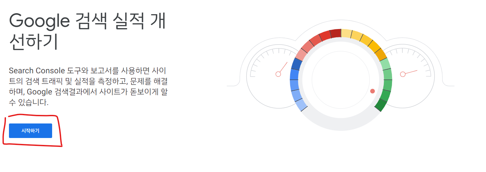
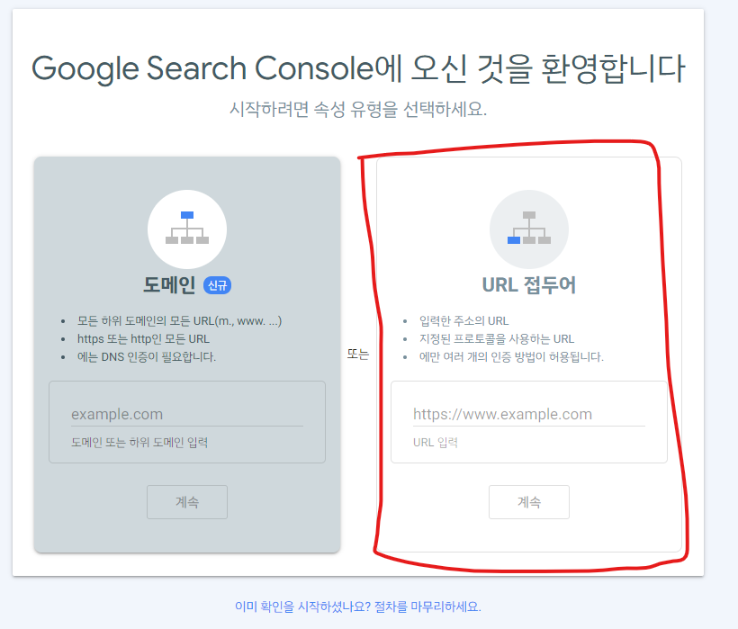
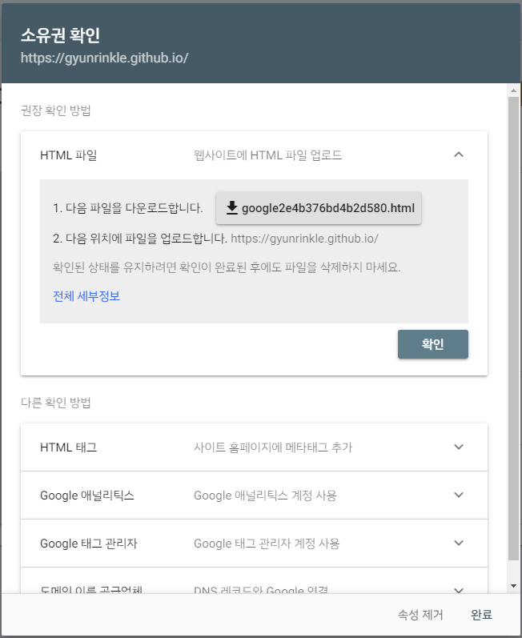
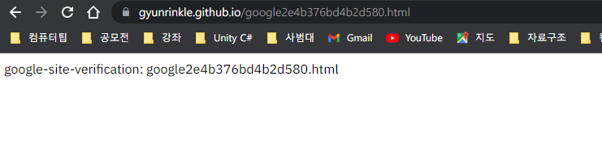
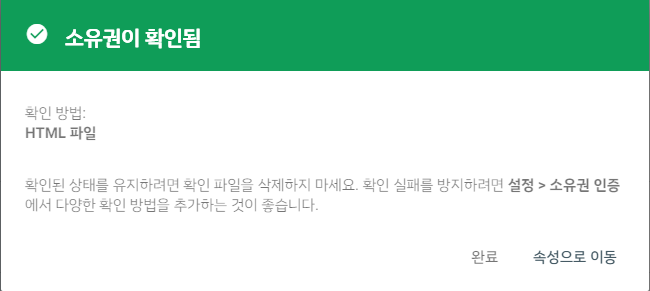
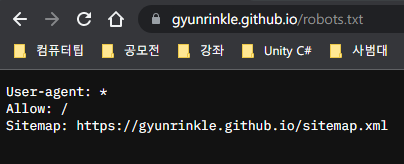
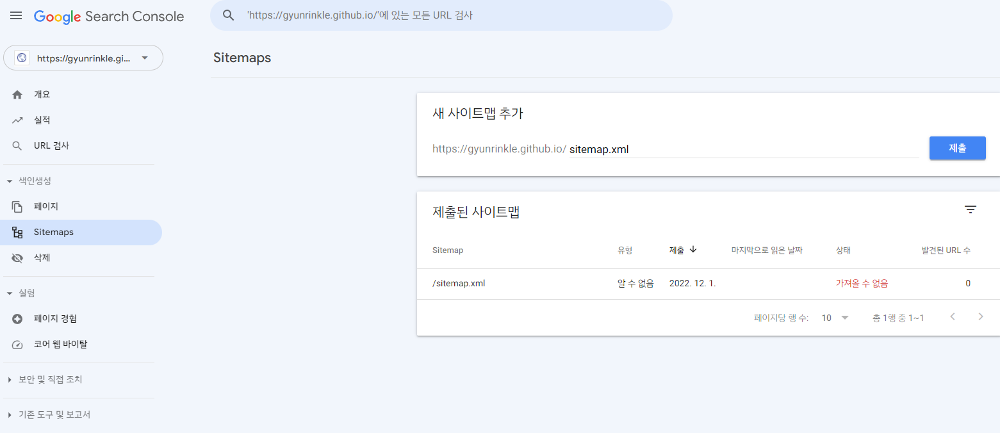

# 검색창에 어떻게 노출 시킬까?

Google Search Console에 블로그 URL을 등록해서, 구글 웹 크롤러가 주기적으로 블로그 웹사이트를 크롤링할 수 있게 작업을 해줘야 한다. 

- Google Search Console(혹은 다른 검색 엔진)에서 제공하는 html 파일
- `sitemap.xml` (Google 웹크롤러가 주기적으로 어떤 URL들을 크롤링해야 되는지 체크하는 사항을 명시해둔 파일)
- `robots.txt` (Google 웹크롤러가 접근하고자 하는 url을 `sitemap.xml`을 통해 확인하고, `robots.txt`를 통해 크롤링 때의 제한 사항을 확인하고, 이를 기반으로 본래의 웹사이트로 크롤링 결과를 가져간다.)

가 필요하다.

# Google Search Console 소유권 확인

<https://search.google.com/search-console/about>에 접속을 한다.



시작하기 버튼을 눌러준다.



필자는 `<GitHub Username>.github.io` URL을 쓰기 때문에 접두어를 선택했다. 



URL에 본인 블로그 URL을 입력하면, 다음과 같은 모달창이 뜬다. html파일을 다운로드하고, 본인 블로그 repository의 root directory(`/`)에 저장을 한다. 그리고 원격 저장소로 push한다.





`<GitHub Username>.github.io/<html파일 이름>`으로 접속을 했을 때, 위의 사진과 같이 잘 뜬다면, html파일이 잘 등록이 된 것이다.



아까 떴던 모달창의 확인 버튼을 누르면, `<Github Username>.github.io`에 Google Search Console이 줬던 html파일이 잘 등록이 됐는지, 확인하게 된다. 그리고 html파일이 웹사이트에 등록된 것이 확인이 되면, 위의 사진과 같은 결과창이 나온다. 웹사이트에 대한 소유권이 확인된 것이다.

# `sitemap.xml` 작성하기


```ruby
---
layout: null
---

<?xml version="1.0" encoding="UTF-8"?>
<urlset xmlns:xsi="http://www.w3.org/2001/XMLSchema-instance" xsi:schemaLocation="http://www.sitemaps.org/schemas/sitemap/0.9 http://www.sitemaps.org/schemas/sitemap/0.9/sitemap.xsd" xmlns="http://www.sitemaps.org/schemas/sitemap/0.9">
  
    <url>
      <loc>{{ site.url }}{{ post.url }}</loc>
      
        <lastmod>{{ post.date | date_to_xmlschema }}</lastmod>
      
        <lastmod>{{ post.lastmod | date_to_xmlschema }}</lastmod>
      

      
        <changefreq>weekly</changefreq>
      
        <changefreq>{{ post.sitemap.changefreq }}</changefreq>
      

      
          <priority>0.5</priority>
      
        <priority>{{ post.sitemap.priority }}</priority>
      

    </url>
  
</urlset>
```


liquid template을 이용하여 위와 같이 `sitemap.xml`을 작성하여, root directory(`/`)에 저장하고, 원격 저장소에 push하자. 


그리고 `https://<GitHub Username>.github.io/sitemap.xml`로 접속을 했을 때, 위의 사진과 같이 liquid template 오류 없이 잘 실행되어, 블로그 post url과 마지막 수정시간 등이 잘 떠야 한다. 잘 뜬다면, `sitemap.xml`이 잘 작성된 것이다.

# `robots.txt` 작성하기


```
User-agent: *
Allow: /
Sitemap: https://<GitHub Username>.github.io/sitemap.xml
```


liquid template을 이용하여, 위와 같이 `robots.txt`를 작성하여, root directory(`/`)에 저장하고, 원격 저장소에 push 하자.




`https://<GitHub Username>.github.io/robots.txt`로 접속을 했을 때, 위의 사진과 같이 내용이 잘 나오면, `robots.txt`도 웹사이트에 등록이 잘 된 것이다.


# Google Search Console에 sitemap 제출




Google Search Consoel -> sitemaps 페이지에서 본인 `sitemap.xml`을 등록해준다.
처음 등록 시에는 실패/가져올 수 없음이라고 뜬다고 한다. 기다려 보자

# Naver

Google Search Console의 과정과 그냥 똑같다. 구글링해보자.

# 출처

[출처](https://velog.io/@eona1301/Github-Blog-%EA%B2%80%EC%83%89%EC%B0%BD-%EB%85%B8%EC%B6%9C%EC%8B%9C%ED%82%A4%EA%B8%B0)

[출처](https://khs613.github.io/github/google-search-sitemap/)

[출처](http://jinyongjeong.github.io/2017/01/13/blog_make_searched/)