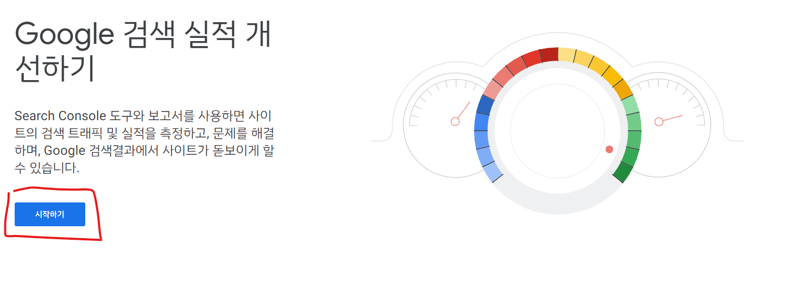

# Google Search Console

<https://search.google.com/search-console/about>에 접속을 한다.



시작하기 버튼을 눌러준다.


필자는 `<GitHub Username>.github.io` URL을 쓰기 때문에 접두어를 선택했다. 


URL에 본인 블로그 URL을 입력하면, 다음과 같은 모달창이 뜬다. html파일을 다운로드하고, 본인 블로그 repository의 root directory(`/`)에 저장을 한다.


live-server로 방금 저장한 html을 열어보고, 다음과 같이 잘 뜨면 등록이 잘 된 것이다.

# `sitemap.xml` 생성하기


```ruby
---
layout: null
---

<?xml version="1.0" encoding="UTF-8"?>
<urlset xmlns:xsi="http://www.w3.org/2001/XMLSchema-instance" xsi:schemaLocation="http://www.sitemaps.org/schemas/sitemap/0.9 http://www.sitemaps.org/schemas/sitemap/0.9/sitemap.xsd" xmlns="http://www.sitemaps.org/schemas/sitemap/0.9">
  
    <url>
      <loc>{{ site.url }}{{ post.url }}</loc>
      
        <lastmod>{{ post.date | date_to_xmlschema }}</lastmod>
      
        <lastmod>{{ post.lastmod | date_to_xmlschema }}</lastmod>
      

      
        <changefreq>weekly</changefreq>
      
        <changefreq>{{ post.sitemap.changefreq }}</changefreq>
      

      
          <priority>0.5</priority>
      
        <priority>{{ post.sitemap.priority }}</priority>
      

    </url>
  
</urlset>
```


liquid template을 이용하여 위와 같이 `sitemap.xml`을 작성하여, root directory(`/`)에 저장하고, 원격 저장소에 push하자.


